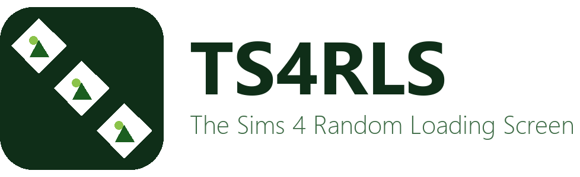

  <picture>
    <source media="(prefers-color-scheme: dark)" srcset="assets/logo_dark.png">
    
  </picture>

# TS4RLS — The Sims 4 Random Loading Screen

Automatically picks a random image from a folder and installs it as your Sims 4 loading screen mod — run it before launching the game and get a fresh screen every time.

**Version 2.0.4** — see [CHANGELOG.md](CHANGELOG.md) for release history.

Website: https://ts4rls.stuxie.dev  
Repository: https://github.com/TS4RLS/Engine  
License: [Closed-source](LICENSE.md)

---

## Download

Grab the latest **`Sims4RandomLoadingScreen`** executable from the
[Releases page](https://github.com/TS4RLS/Engine/releases) —
it's a single self-contained file, nothing else to install. Double-click it
for a GUI, or run it from a terminal with `--cli` for a text menu.

- **First run** walks you through a quick setup wizard (images folder, Mods
  folder, and a handful of optional settings) and saves it for you — no
  manual config file editing required.
- Settings are stored per-user (Windows: `%APPDATA%`, macOS:
  `~/Library/Application Support`, Linux: `~/.config`), so the app works
  the same no matter where you put the executable.

---

## Using it

**1. Add your images**

Drop PNG, JPG, BMP, WebP, or TIFF images into the images folder you set up. Sub-folders are scanned automatically. One image is enough; the more you have, the more variety you get.

**2. Run before launching the game**

- **GUI**: double-click the executable, go to the **Actions** tab, click
  **Generate loading screen**.
- **Text menu**: run it with `--cli` and choose **1) Generate**.
- **Unattended** (scripts, other launchers, a Steam shortcut): run it with
  `--generate` (add `--force-launch` to always launch the game regardless
  of the `launch_game` setting). It never blocks waiting for a keypress.

Either way, it picks a random image, builds the mod, and optionally launches Sims 4 for you.

---

## Configuration

Use the **Settings** tab (GUI) or the **Configure settings** option
(text menu) to change anything — both read and write the same config file.
Only `images_folder` and `mods_folder` are required; everything else has a
default.

| Key | Required | Default | Description |
|---|---|---|---|
| `images_folder` | ✓ | — | Folder containing your source images |
| `mods_folder` | ✓ | — | Your Sims 4 Mods folder |
| `is_vertical` | | `true` | When `true`, combines **2 portrait images** side-by-side into one landscape loading screen |
| `rename_files` | | `false` | When `true`, renames every image in `images_folder` to a random 32-character alphanumeric name and converts it to JPEG before picking a random image |
| `launch_game` | | `true` | Automatically launch Sims 4 after generating the mod |
| `non_interactive` | | `true` | When `true`, never blocks on the "press any key to close" prompt (only shown when `launch_game` is `false`) |
| `launch_via_steam` | | `true` | Launch via Steam (`steam://rungameid/...`) |
| `game_exe` | | `""` | Direct path to `TS4_x64.exe` — only used when `launch_via_steam` is `false` |
| `target_width` / `target_height` | | `1920` / `1080` | Loading screen output size |
| `create_curseforge_version` | | `false` | Whether `src/build/executable_builder.py` also builds the CurseForge (`TS4_x64`) executable — dev/build-time only |
| `app_icon` | | `"dark"` | Which brand icon (`"dark"` or `"light"`) the built app executable uses — dev/build-time only |

### Vertical mode

When `is_vertical` is `true`, the app randomly picks **two portrait-oriented images** and stitches them side-by-side into a single landscape loading screen. Use tall/portrait photos for best results. Set to `false` to use one image directly.

---

## CurseForge pre-launch script

A copy of the same executable, named **`TS4_x64`**/`TS4_x64.exe`
(mirroring Sims 4's own game executable) and using a plumbob-style icon
that mimics Sims 4's own game icon rather than the TS4RLS brand icon,
automatically generates a new loading screen and launches the game with no
arguments needed — use it as your CurseForge pre-launch script. See
[docs/CONTRIBUTING.md](docs/CONTRIBUTING.md) for how to build it yourself.

---

## Steam artwork

`assets/steam/` has a full set of custom Steam library artwork for the
non-Steam-game shortcut — see **[docs/STEAM_GUIDE.md](docs/STEAM_GUIDE.md)**
for the asset list and how to apply it, or use the **Save Steam artwork
(.zip)...** button on the app's About tab if you don't have the source repo.

---

## How it works

The Sims 4 loading screen is a `.package` file (DBPF 2.0 format) containing a single compressed image at a known resource key. Each run:

1. Scans `images_folder` and picks one image at random (or two, in vertical mode)
2. Resizes and centre-crops to match the template's resolution
3. Splices the new image into the template's GFX resource
4. Writes `RandomLoadingScreen.package` to `Mods/RandomLoadingScreen/`

The output won't conflict with other mods as long as no other loading screen `.package` exists in your Mods folder — only one can be active at a time.

---

## Troubleshooting

| Problem | Fix |
|---|---|
| `config.json not found` | Run the app — the setup wizard runs automatically the first time |
| `config.json missing required key` | Use the Settings tab / Configure settings option to fill it in |
| `Images folder not found` | Update `images_folder` in Settings |
| `Mods folder not found` | Update `mods_folder` in Settings |
| `No images found` | Check the folder path and that your files are PNG/JPG/BMP/WebP/TIFF |
| Loading screen unchanged in-game | Delete `localthumbcache.package` from your Mods folder, then relaunch |
| Still showing blue loading screen | Remove any other loading screen `.package` from your Mods folder |

---

## Development

This section is for contributors running from source — end users should
just download the executable above.

- **Requirements**: Python 3.6+, `pip install -r requirements.txt`
  (`Pillow`/`PyInstaller` are also installed automatically if missing).
- Run **`Launcher.bat`** (Windows) or **`./Launcher.sh`** (macOS/Linux) for
  a small dev menu: open the app, build the executable(s), or run the test
  suite.
- `python src/app.py` (GUI), `python src/app.py --cli` (text menu), or
  `python src/app.py --generate [--force-launch]` (headless) run the app
  directly without building anything.
- `python src/build/executable_builder.py` builds
  `Sims4RandomLoadingScreen`(`.exe`) and, if `create_curseforge_version` is
  `true` in `config.json`, `TS4_x64`(`.exe`) too. PyInstaller can't
  cross-compile, so build on each platform you want a native executable
  for.
- `pytest -v` runs the test suite (`.github/workflows/ci.yml` runs the same
  on every push/PR).

See **[docs/CONTRIBUTING.md](docs/CONTRIBUTING.md)** for the full project
layout and release flow.

---

## Do not rename or remove

These files in `assets/` are required at runtime/build time, not just artwork:

- `template.package` — base mod template every generated loading screen is spliced into
- `icon_dark.ico` / `icon_dark.icns` / `icon_dark.png` — the app's default icon and the GUI's dark-mode branding
- `icon_light.ico` / `icon_light.icns` / `icon_light.png` — the app's alternate icon (`app_icon: "light"`) and the GUI's light-mode branding
- `icon_curseforge.ico` / `icon_curseforge.icns` / `icon_curseforge.png` — icon for the `TS4_x64` build, styled to mimic Sims 4's own game icon
- `logo_dark.png` / `logo_light.png` — the wordmark logo (for dark/light-background contexts respectively)

---

*Built & Maintained by  [StuxieDev](https://github.com/StuxieDev).*
